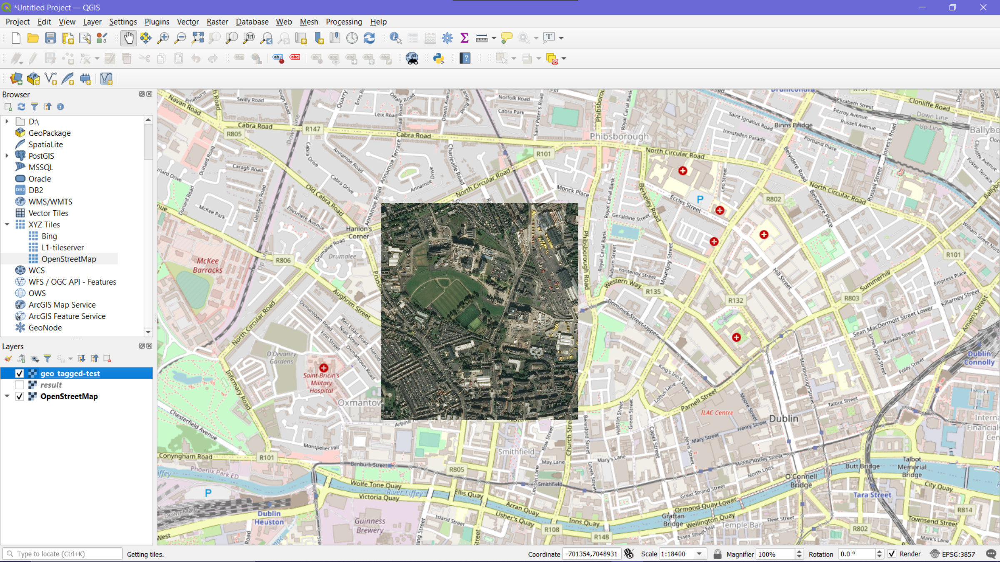

# Convert image to geo-referenced *tiff* file
### Input
- -i : input image (jpg, png, tiff)
- -o : output image name
- -c : coordinates of the image corners [min Longitude , min Latitude , max Longitude , max Latitude]

### Output
geo-referenced tiff file

### Files
- img2geo.py : python program
- utils.py   : helper functions
- run.bat    : Windows .bat file that can be used to same functionality 
___

> Manual geo-referencing

> Automated process 

